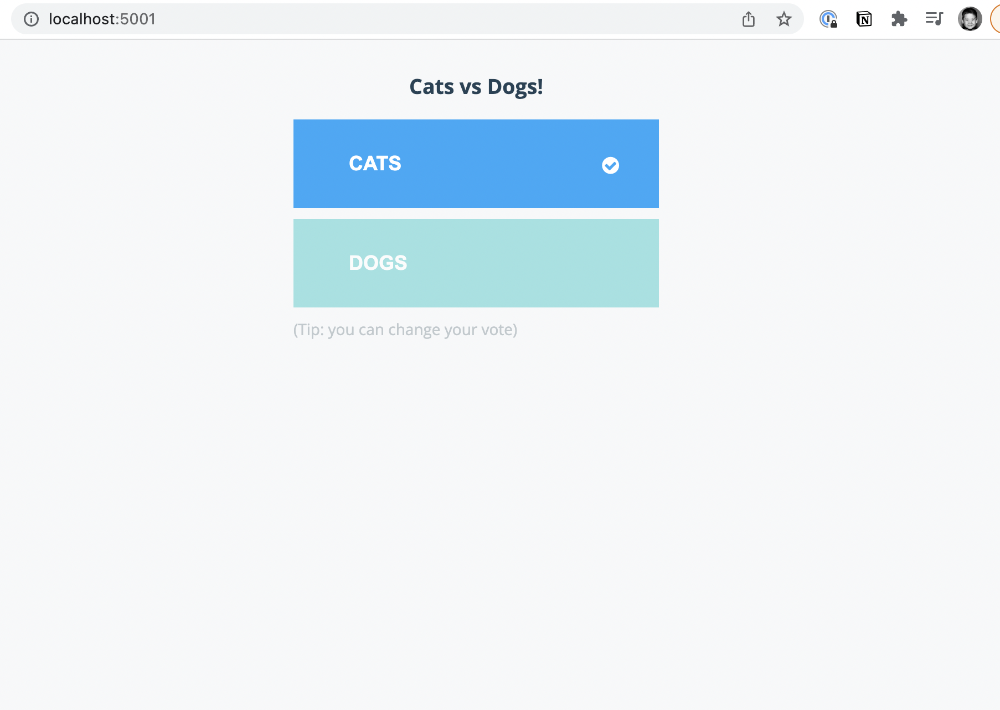
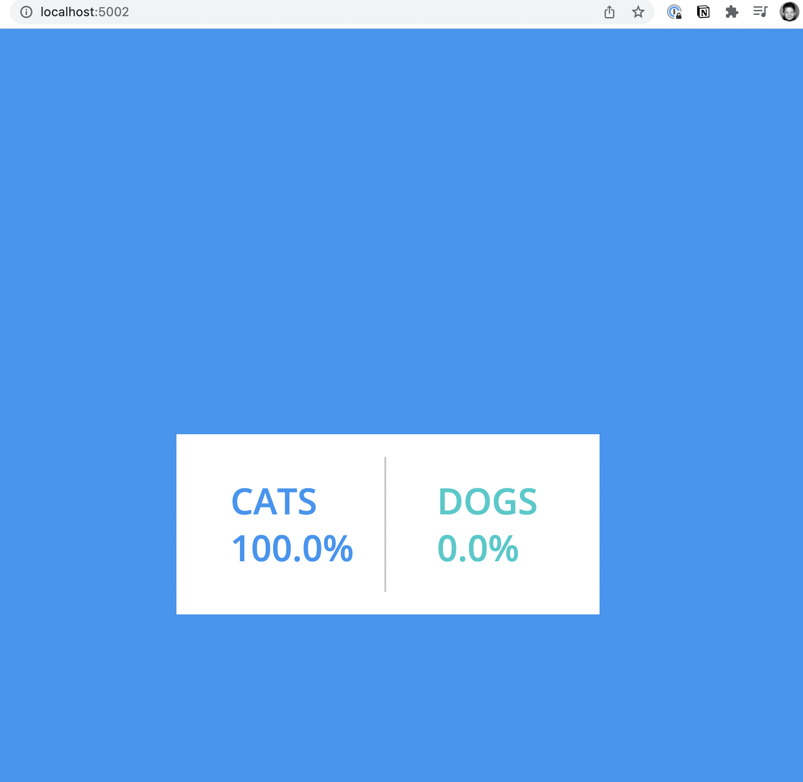

# docker-compose-practice-vote-app

This repo contains a group of apps for practising how to use docker-compose.
## Architecture

    A front-end web app in Python or ASP.NET Core lets you vote between two options.
    A Redis or NATS queue which collects new votes
    A .NET Core, Java or .NET Core 2.1 worker consumes votes and stores them
    A Postgres or TiDB database backed by a Docker volume
    A Node.js or ASP.NET Core SignalR web app that shows the results of the voting in real-time

## First, run everything manually
1. build images
    1. build ./result
        ```
        docker build --platform=linux/x86_64 it result .
        ```
        notice specified platform to be `linux/x86_64` with Mac M1 chip, otherwise might run into issue `qemu-x86_64: Could not open '/lib64/ld-linux-x86-64.so.2': No such file or directory`
    2. build ./vote
        ```
        docker build -t vote .
        ```
    3. build ./worker
        ```
        docker build -t worker .
        ```
2. build and run containers
    1. run redis
        ```
        docker run -d --name=redis redis
        ```
    2. run Postgres
        ```
        docker run -d --name=db --env POSTGRES_PASSWORD=postgres --env POSTGRES_USER=postgres postgres
        ```
        note `--env POSTGRES_PASSWORD=postgres` and `--env POSTGRES_USER=postgres` enviriment variables are needed for running postgres.
    3. link vote to Redis and run it
        ```
        docker run -d --name=vote -p 5001:80 --link redis:redis vote
        ```
        notice linking `redis` to `vote`
    4. link result to DB
        ```
        docker run -d --name=result -p 5002:80 --link db:db result 
        ```
    5. link worker to DB and redis
        ```
        docker run -d --name=worker --link db:db --link redis:redis worker
        ```
3. observe 
    see vote site running 
    see result site running 
4. conduct docker compose-ymal file
    ```
    version: '3'
    services:
    result:
        platform: linux/amd64 //to avoid Mac M1 chip error, see step 1.1
        build: ./result
        ports: 
        - 5002:80

    vote:
        build: ./vote
        ports:
        - 5001:80

    worker:
        build: ./worker

    db:
        image: postgres
        environment:    // set env variables for postgres, see step 2.2
        - POSTGRES_PASSWORD=postgres 
        - POSTGRES_USER=postgres

    redis:
        image: redis
    ```
